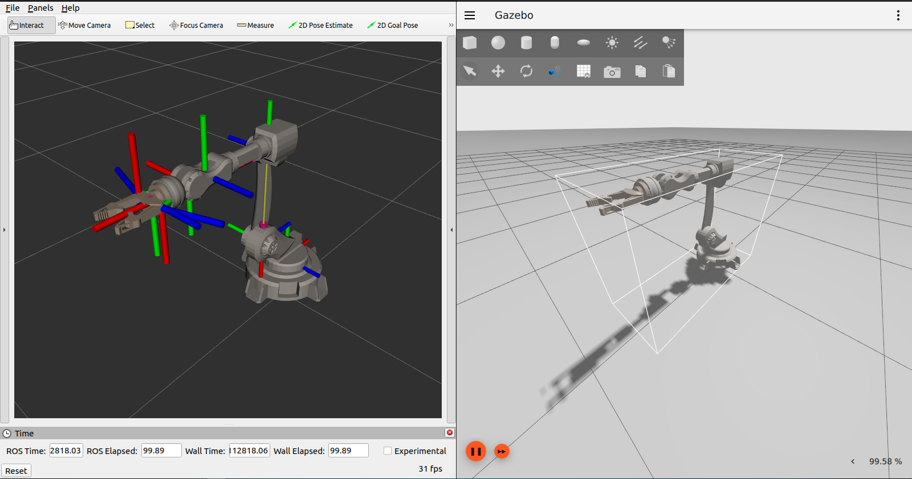

# Example open source URDF robot for MoveIt2



### How to use:
Create ros2 workspace and clone this repository:
```
mkdir -p ~/solid_robot_ws/src
cd ~/solid_robot_ws/src
git clone ...
cd ..
colcon build
. install/setup.bash
```
<p>To launch description use the following command:</p>

```
ros2 launch solid_robot display.launch.py 
```

<p>To launch Gazebo simulation use the following command:</p>

```
ros2 launch solid_robot gazebo.launch.py 
```

<p>Launch ROS2 controller in new terminal:</p>

```
source ~/solid_robot_ws/install/setup.bash
ros2 launch solid_robot_controller controller.launch.py 
```

<p>Launch MoveIt in new terminal:</p>

```
source ~/solid_robot_ws/install/setup.bash
ros2 launch solid_robot_moveit moveit.launch.py 
```
It should open rviz2 where you can send commands to robot